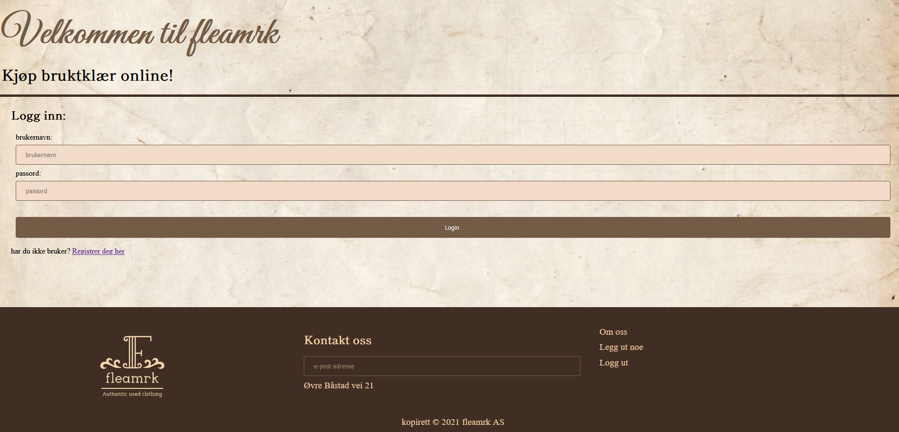
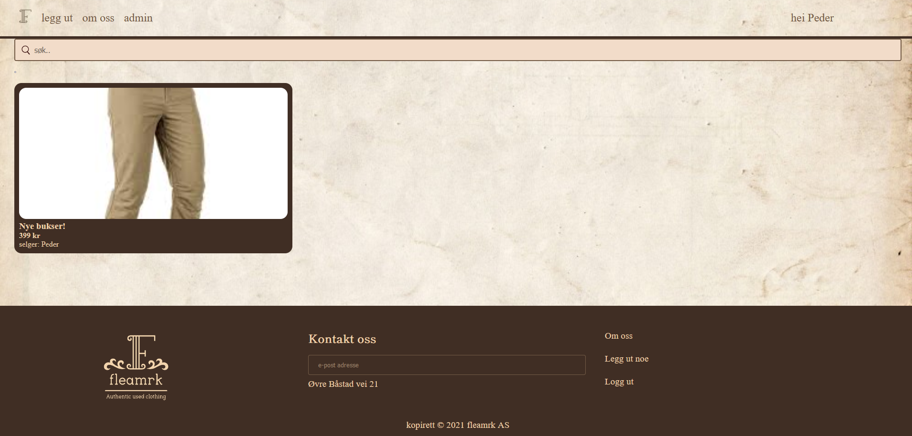
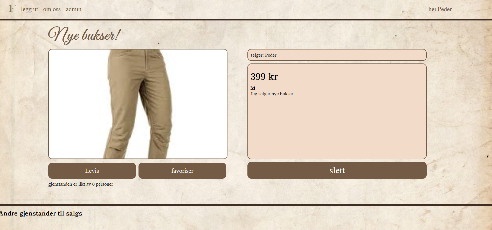

# Fleamrk


## Introduction

Fleamrk is a used-market for buying and selling used goods. 

This is a fullstack web-app written in PHP and SQLite3.

## Features

* User authentication
* Admin editing
* Each user can publish articles
* Database queries written in SQL


## Requirements

* PHP 7.4
* SQLite3

## Installation

1. Clone the repository
2. Enable the SQLite3 extension in your php.ini file
3. Run the following command in the src directory of the project:
```bash
php -S localhost:8000 -t src
```
4. Open your browser and go to localhost:8000

## Pictures

### Login page


### Main page


### Item page



## Authors

Written by Peder Brennum

